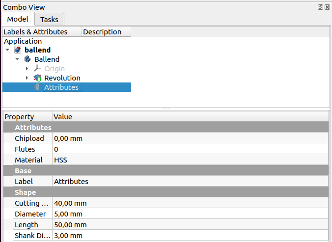
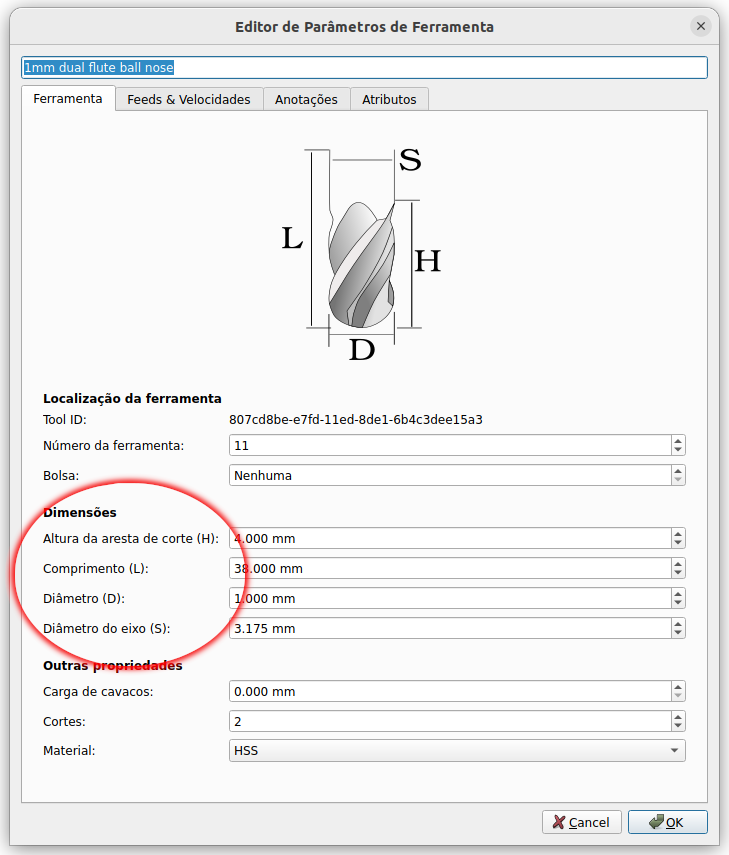

# Creating your own shapes

FreeCAD differentiates between tools (toolbits) and tool shapes (tool types).
On this page, we explain how to create your own tool shapes.

1. It is best to start by using an existing tool shape as a template.
   You can download one [from this folder](../btl/resources/shapes).
   I recommend you download both, the shape file (.fcstd) and the
   diagram file (.svg).

1. Open the shape file in FreeCAD, changing the body as you like. Some notes:
    * Make sure your shape's zero is in the right position.

    * Make sure that your sketch does not hard code the dimensions,
      it should reference the shape attributes instead.

    * You can add or remove attributes in the properties panel as needed.
      **The names will be important later**, because you can reference them
      from the .svg file to ensure proper labeling in the UI.
      
      

1. Once done, save the file and open the diagram file using [Inkscape](https://inkscape.org/).

1. Draw your tool diagram as needed. Make sure that for each of your
   shape's attributes, there is a label in your picture.

1. Now the important part: To make sure that FreeCAD shows the correct
   abbreviation for each of your tool parameters, you need to mark each
   label in your diagram with the name of the FreeCAD attribute.
   
   
   
   Start by clicking the label.

1. Open the object properties by pressing Shift+Ctrl+o.

1. In the ID field, enter the FreeCAD attribute name. However, you have
   to translate the attribute name as follows:
    * Before every capital letter, insert an underscore.
    * Lowercase everything.
    * For example, CuttingEdgeHeight in FreeCAD becomes `cutting_edge_height`
      in Inkscape.
      
      

That's it. Now you can place both files in your tool library path into
the `shapes/` subfolder. You may also consider contributing your new tool
to BTL - just send a pull request or open an issue with the files attached.
